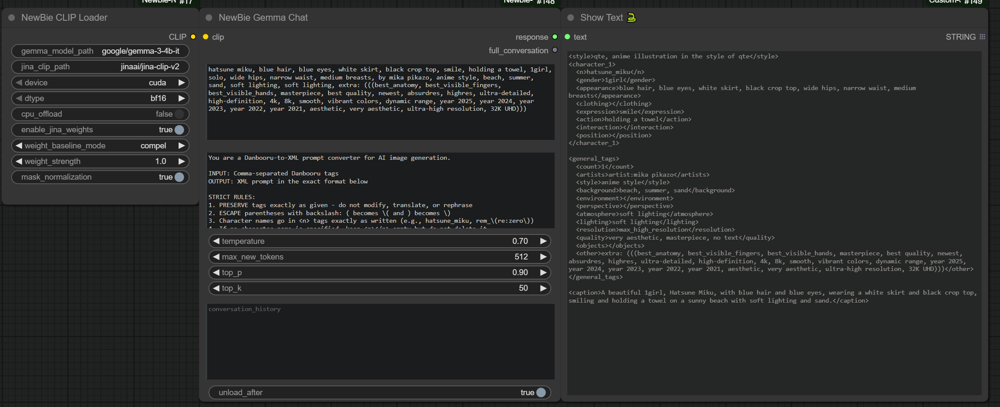
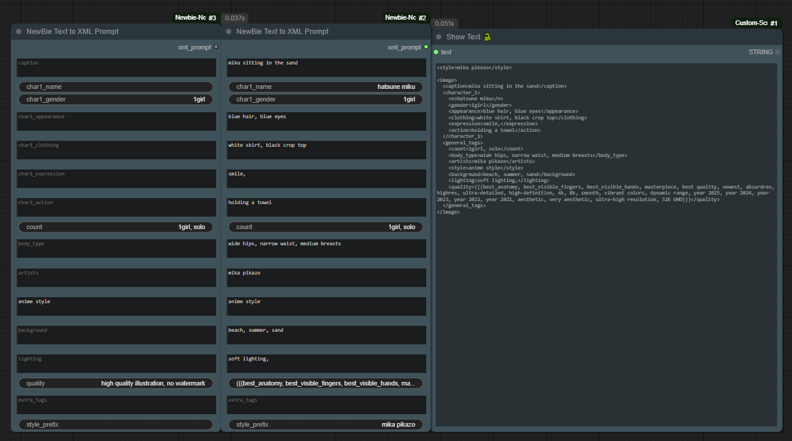

# ComfyUI-Newbie-Nodes

Custom nodes for the NewBie image generation model in ComfyUI.

## XML Prompt Tools

Since you're already loading **Gemma 3 4B** with the NewBie CLIP Loader, why not use it to generate XML prompts for you?

Or if you prefer manual control, use the XML Builder nodes to write your own.

---

### Option 1: Let Gemma Write Your XML Prompts

Use the **NewBie Gemma Chat** node to convert Danbooru tags into structured XML prompts.

Just connect your CLIP model, paste your tags, and get a formatted XML prompt back.

**Workflow:** [XML_GEMMA.json](workflows/XML_GEMMA.json)

---

### Option 2: Build XML Prompts Manually

Use the **XML Builder** nodes for full control over your prompt structure.

- **NewBie Character Builder** - Create character blocks with appearance, clothing, expression, etc.
- **NewBie General Tags Builder** - Add artists, style, lighting, quality tags
- **NewBie XML Prompt Assembler** - Combine everything into the final `<image>` XML

**Workflow:** [XML_BUILDER.json](workflows/XML_BUILDER.json)

---

## Available Nodes

### LLM
- `NewBie Gemma Chat` - Chat with Gemma using your loaded CLIP model
- `NewBie Gemma Chat (Advanced)` - More generation options (seed, repetition penalty, etc.)

### XML Builder
- `NewBie Character Builder` - Build individual character XML blocks
- `NewBie General Tags Builder` - Build general_tags XML block
- `NewBie XML Prompt Assembler` - Combine into final XML
- `NewBie Quick Character` - Paste-friendly character input with [section] markers
- `NewBie Text to XML Prompt` - All-in-one simple prompt builder
- `NewBie Character Combiner` - Combine multiple characters

### Core
- `NewBie CLIP Loader` - Load Gemma + Jina CLIP
- `NewBie CLIP Text Encode` - Encode prompts
- `NewBie UNet Loader` - Load the diffusion model
- `Model Sampling (Newbie)` - Sampling configuration

---

## Installation

Drop this folder into your `ComfyUI/custom_nodes/` directory and restart ComfyUI.

Requires:
- `transformers`
- `safetensors`
